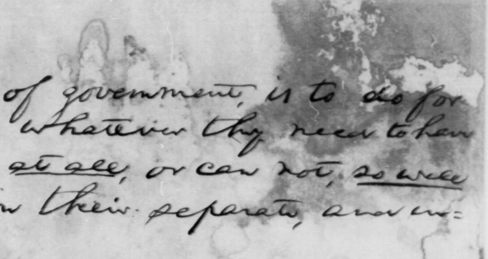
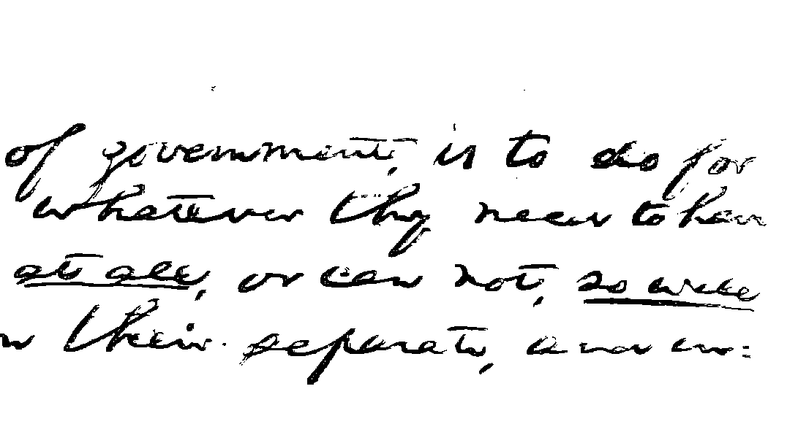

# torch-image-binarization




Local image binarization algorithms implemented in Pytorch. Includes the [Otsu thresholding algorithm](https://en.wikipedia.org/wiki/Otsu's_Method) and the algorithm by [Su et al.](https://doi.org/10.1145/1815330.1815351) (which is an extension of the Otsu algorithm). The algorithms are implemented to optimize performance (at least 10x faster than the [CPU-based version](https://github.com/nopperl/vectorized-image-binarization))

This was written to test the benefits of `torch.compile`. For a log of performance improvements, refer to `optimizations.ipynb`. This notebook expects `triton==3.0.0` and `torch==2.3.0`.

## Usage

Install the package (after cloning the repo):

    pip install .

Read an image:
```
from torchvision.io import ImageReadMode, read_image 
img = read_image("test_image.png", mode=ImageReadMode.GRAY)
```

Binarize the image:
```
from torck_image_binarization.thresholding import su
su(img)
```

For more information, refer to `torch_image_binariztion/main.py` 

